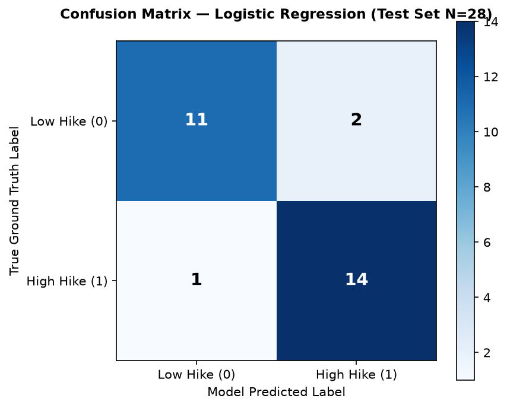

# JDS Skill Traits Model Evaluation Report — SkillGap AI

> **Generated by**: `ai-service/training/train_jds_models.py`  
> **Trained On**: 2026-10-07 10:20:08 UTC  
> **Task**: Binary Classification (`salary_hike_high_or_low`)

---

## 1. Dataset Overview
- **Dataset**: `JDS Skill Traits.xlsx`
- **Training Samples**: 111 (80% stratified split)
- **Held-Out Test Samples**: 28 (20% stratified split)
- **Input Features (5)**: `big_data_skills, maths-stats_skills, coding_skills, ai_and_ml_skills, dashboard_and_storytelling_skills`
- **Target Column**: `salary_hike_high_or_low` (0 = Low Hike, 1 = High Hike)
- **Identifier Handling**: `id` column strictly excluded from all training and testing matrices.

## 2. Baseline Models Cross-Validation (Training Set Only)

Stratified 5-Fold Cross-Validation evaluated on training data (`N=111`, `random_state=42`):

| Model | Preprocessing | CV Accuracy | CV Precision | CV Recall | CV F1 Score |
| :--- | :--- | :--- | :--- | :--- | :--- |
| **Logistic Regression** | StandardScaler | 0.8458 ± 0.0941 | 0.8352 ± 0.1079 | 0.8970 ± 0.0617 | **0.8630 ± 0.0788** |
| **Random Forest** | Unscaled | 0.7925 ± 0.0377 | 0.8410 ± 0.0951 | 0.7742 ± 0.1356 | **0.7907 ± 0.0538** |
| **SVM (RBF)** | StandardScaler | 0.8281 ± 0.0614 | 0.8372 ± 0.1051 | 0.8606 ± 0.0737 | **0.8415 ± 0.0468** |

## 3. Model Selection Decision
**Selected Model**: **Logistic Regression**

### Justification:
1. **Highest Cross-Validation F1 Score**: `0.8630` vs. `0.8415` (SVM) and `0.7907` (Random Forest).
2. **Strongest Sensitivity/Recall**: Achieved `0.8970` average recall on high-hike candidates.
3. **Intrinsic Explainability**: As a linear generalized model, Logistic Regression provides direct, transparent feature coefficients that can be explained to candidates without black-box surrogate methods.
4. **Stability & Low Variance**: Appropriate inductive bias for small tabular datasets (N=111), avoiding overfitting risks observed in tree ensembles.

## 4. Final Evaluation on Held-Out Test Set

> *The held-out test set (N=28) was evaluated exactly ONCE on the selected model to ensure unbiased generalization reporting.*

| Test Metric | Value |
| :--- | :--- |
| **Test Accuracy** | **0.8929** (89.3%) |
| **Test Precision** | **0.8750** (87.5%) |
| **Test Recall** | **0.9333** (93.3%) |
| **Test F1 Score** | **0.9032** |

### Confusion Matrix (Test Set N=28):
- **True Negatives (TN)**: 11 (Correctly classified Low Hike)
- **False Positives (FP)**: 2 (Low Hike misclassified as High)
- **False Negatives (FN)**: 1 (High Hike misclassified as Low)
- **True Positives (TP)**: 14 (Correctly classified High Hike)

## 5. Feature Impact & Interpretability

Standardized Logistic Regression Coefficients (Log-Odds Impact on Salary Hike):

| Rank | Feature Name | Standardized Coefficient | Interpretation |
| :--- | :--- | :--- | :--- |
| 1 | `maths-stats_skills` | **+1.2282** | Strong Positive Driver |
| 2 | `dashboard_and_storytelling_skills` | **+0.8558** | Strong Positive Driver |
| 3 | `ai_and_ml_skills` | **+0.7844** | Moderate Positive Driver |
| 4 | `big_data_skills` | **+0.6282** | Moderate Positive Driver |
| 5 | `coding_skills` | **+0.4780** | Positive Driver |

## 6. Data Leakage Verification

| Verification Check | Standard | Result | Status |
| :--- | :--- | :--- | :--- |
| **Scaler Training-Only Fit** | StandardScaler fitted exclusively on X_train (N=111) | Samples seen = 111 | **PASS** |
| **Test Set Isolation** | Held-out test set unused during CV model selection | Test set isolated | **PASS** |
| **Target Excluded from X** | Target column not in features | Features = 5 skill columns | **PASS** |
| **Identifier Excluded from X** | `id` column strictly excluded | `id` omitted from all matrices | **PASS** |
| **Train/Test Disjointness** | 0 overlapping row indices | Complete partition separation | **PASS** |

## 7. Limitations & Ethical Considerations
> [!IMPORTANT]
> **Mandatory Limitations Disclosure**:
> 1. **Small Dataset Size**: The training set contains only 111 records and the test set 28 records. Although cross-validation confirms stability, generalization to diverse external cohorts is bounded.
> 2. **Experimental Nature**: Model outputs represent experimental scoring benchmarks intended to guide candidate upskilling, not certified recruitment determinations.
> 3. **Unobserved Variables**: Compensation growth is influenced by macroeconomic factors, geographic location, company budget, negotiation, and domain pedigree—none of which are captured in these five technical skill ratings.
> 4. **No Real-World Guarantee**: This model should never be presented to candidates or employers as a real-world salary or compensation guarantee.

## 8. Persisted Artifacts
- `ai-service/models/jds/jds_best_model.joblib`
- `ai-service/models/jds/jds_model_metadata.json`
- `ai-service/evaluation/plots/jds_confusion_matrix.png`
- `ai-service/evaluation/jds_model_evaluation.md`