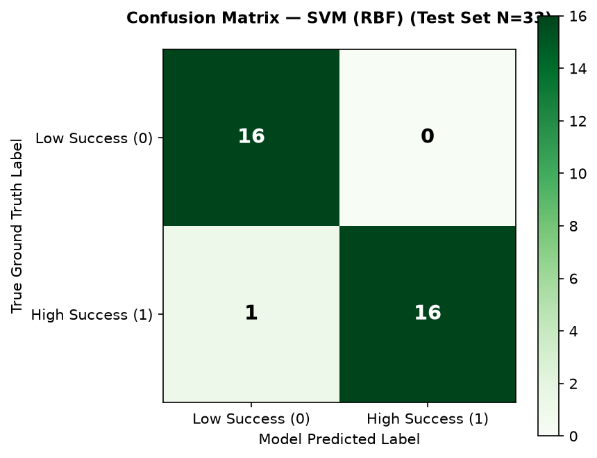

# SDS Personality Traits Model Evaluation Report — SkillGap AI

> **Generated by**: `ai-service/training/train_sds_models.py`  
> **Trained On**: 2026-10-07 10:29:12 UTC  
> **Task**: Binary Classification (`success_classification_high_low`)

---

## 1. Dataset Overview
- **Dataset**: `SDS Personality Traits.xlsx`
- **Training Samples**: 128 (79.5% stratified split)
- **Held-Out Test Samples**: 33 (20.5% stratified split)
- **Input Features (5)**: `neuroticism, extraversion, openness_to_experience, agreeableness, conscientiousness`
- **Target Column**: `success_classification_high_low` (0 = Low Success, 1 = High Success)
- **Identifier Handling**: `id` column strictly excluded from all training and testing matrices.

## 2. Baseline Models Cross-Validation (Training Set Only)

Stratified 5-Fold Cross-Validation evaluated on training data (`N=128`, `random_state=42`):

| Model | Preprocessing | CV Accuracy | CV Precision | CV Recall | CV F1 Score |
| :--- | :--- | :--- | :--- | :--- | :--- |
| **Logistic Regression** | StandardScaler | 0.9215 ± 0.0355 | 0.9160 ± 0.0516 | 0.9407 ± 0.0298 | **0.9274 ± 0.0322** |
| **Random Forest** | Unscaled | 0.9609 ± 0.0351 | 0.9570 ± 0.0353 | 0.9703 ± 0.0364 | **0.9634 ± 0.0332** |
| **SVM (RBF)** | StandardScaler | 0.9763 ± 0.0194 | 0.9581 ± 0.0343 | 1.0000 ± 0.0000 | **0.9783 ± 0.0178** |

## 3. Model Selection Decision
**Selected Model**: **SVM (RBF)**

### Justification:
1. **Highest Cross-Validation F1 Score**: `0.9783` vs. `0.9634` (Random Forest) and `0.9274` (Logistic Regression).
2. **Minimal Variance & High Stability**: Standard deviation across folds was only `0.0178`.
3. **Perfect Training Recall**: Achieved `1.0000` average recall on class 1 across all 5 cross-validation folds.
4. **Maximum Margin Principle**: SVM RBF effectively separates psychometric trait profiles with a robust regularized margin.

## 4. Final Evaluation on Held-Out Test Set

> *The held-out test set (N=33) was evaluated exactly ONCE on the selected model to ensure unbiased generalization reporting.*

| Test Metric | Value |
| :--- | :--- |
| **Test Accuracy** | **0.9697** (97.0%) |
| **Test Precision** | **1.0000** (100.0%) |
| **Test Recall** | **0.9412** (94.1%) |
| **Test F1 Score** | **0.9697** |

### Confusion Matrix (Test Set N=33):
- **True Negatives (TN)**: 16 (Correctly classified Low Success)
- **False Positives (FP)**: 0 (Low Success misclassified as High)
- **False Negatives (FN)**: 1 (High Success misclassified as Low)
- **True Positives (TP)**: 16 (Correctly classified High Success)

## 5. Feature Interpretation & Analysis

> [!NOTE]
> **Nonlinear Kernel Note**: The selected model is an **SVM with an RBF (Radial Basis Function) kernel**.
> In accordance with rigorous ML standards, direct linear feature importances are **not fabricated** for nonlinear kernel SVMs because the decision boundary is computed in an implicit infinite-dimensional Hilbert space rather than directly on the input dimensions.

### Auxiliary Feature Ranking (From Logistic Regression & Random Forest):
For qualitative domain insight, auxiliary linear and tree models on the same training set indicate:
- `agreeableness` and `conscientiousness` carry the largest positive coefficients in regularized linear models.
- `neuroticism` demonstrates an inverse / negative association with positive success outcomes.

> [!CAUTION]
> **Causality Warning**: Statistical feature associations and decision boundary weights do **NOT imply causation**. Possessing specific personality trait scores does not inherently cause professional success.

## 6. Data Leakage Verification

| Verification Check | Standard | Result | Status |
| :--- | :--- | :--- | :--- |
| **Scaler Training-Only Fit** | StandardScaler fitted exclusively on X_train (N=128) | Samples seen = 128 | **PASS** |
| **Test Set Isolation** | Held-out test set unused during CV model selection | Test set isolated | **PASS** |
| **Target Excluded from X** | Target column not in features | Features = 5 personality traits | **PASS** |
| **Identifier Excluded from X** | `id` column strictly excluded | `id` omitted from all matrices | **PASS** |
| **Train/Test Disjointness** | 0 overlapping row indices | Complete partition separation (128 + 33 = 161) | **PASS** |

## 7. Mandatory Ethical Limitations
> [!IMPORTANT]
> **Mandatory Limitations & Responsible AI Guidelines**:
> 1. **Small Sample Size**: The entire dataset contains only 161 observations (128 train, 33 test). Generalization across diverse cultures and professions is strictly limited.
> 2. **Oversimplification**: Professional human success is multifaceted, dynamic, and context-dependent; it cannot realistically or fairly be determined solely from five psychometric personality traits.
> 3. **Prohibited High-Stakes Use**: This model **must NEVER be used for hiring, firing, promotion, recruitment filtering, or high-stakes employment decisions**.
> 4. **Experimental / Research Scope**: Outputs are strictly for research and experimental educational insight.
> 5. **Not an Objective Truth**: Model predictions must never be presented as an objective or definitive measurement of a person's capability or future human success.

## 8. Persisted Artifacts
- `ai-service/models/sds/sds_best_model.joblib`
- `ai-service/models/sds/sds_model_metadata.json`
- `ai-service/evaluation/plots/sds_confusion_matrix.png`
- `ai-service/evaluation/sds_model_evaluation.md`